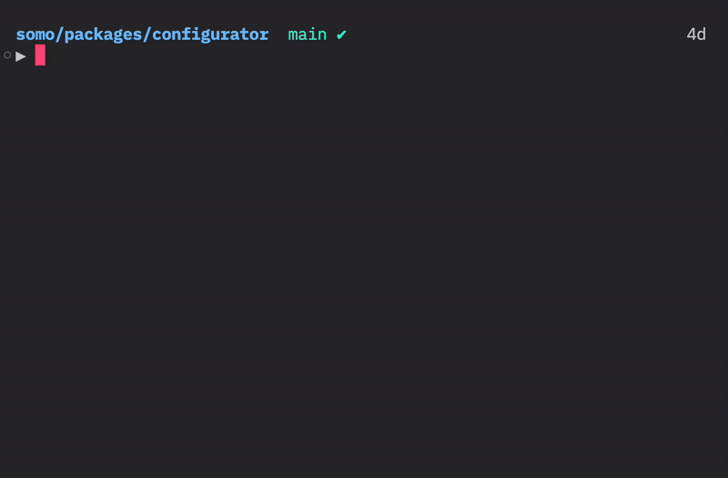

# Zod v3 to v4

[](https://www.npmjs.com/package/zod-v3-to-v4)
[](https://github.com/nicoespeon/zod-v3-to-v4/actions/workflows/ci.yml)
[](#contributors)

This is a [codemod](https://martinfowler.com/articles/codemods-api-refactoring.html) (a tool that automatically transforms code) for migrating from [Zod](https://zod.dev/) v3 to v4.

The migration guide can be found at <https://zod.dev/v4/changelog>



## Using this codemod

> This assumes you have [Node.js](https://nodejs.org/) installed.

The first step for you is to upgrade your Zod version to v4. In doubt, check your `package.json`. Note that if you're using Zod through Astro v6, you don't need to upgrade Zod manually.

Then, you can use this codemod to automatically migrate your code from Zod v3 to v4 syntax.

### Interactive CLI

You can run it with the following command:

```bash
npx zod-v3-to-v4
```

It will ask you for the path to your `tsconfig.json` file, and then it will go through all your files and migrate Zod v3 code to v4.

### Non-interactive CLI

Alternatively, you can pass the path to your `tsconfig.json` file as an argument:

```bash
npx zod-v3-to-v4 path/to/your/tsconfig.json
```

This is useful if you ever need to run the codemod in script (e.g. in a CI pipeline).

### Installing it as a package

You can also install it as a package and run it from your project:

```bash
npm install -ED zod-v3-to-v4
```

And then run it with:

```bash
npx zod-v3-to-v4
```

### Reporting issues

If the codemod missed something or did something wrong, please [open an issue](https://github.com/nicoespeon/zod-v3-to-v4/issues).

## Contributing

This project uses [node.js](https://nodejs.org/en/) and [pnpm](https://pnpm.io/). To get started, run:

```bash
pnpm install
```

To run the tests, run:

```bash
pnpm test
```

We use [ts-morph](https://ts-morph.com) to parse and transform the code.

Useful links:

- [ts-morph](https://ts-morph.com)
- [TS AST viewer](https://ts-ast-viewer.com/)
- [vitest](https://vitest.dev)
- [Zod v4 migration guide](https://zod.dev/v4/changelog)

### Playground

If you want to test the codemod from CLI, you can use the `playground` folder. It contains a `tsconfig.json` file and some sample TypeScript files with Zod v3 code. You can run the codemod on these files with:

```bash
pnpm playground
```

Or interactively:

```bash
pnpm playground:interactive
# Then enter: playground/tsconfig.json
```

## Contributors

<!-- ALL-CONTRIBUTORS-LIST:START - Do not remove or modify this section -->
<!-- prettier-ignore-start -->
<!-- markdownlint-disable -->
<table>
  <tbody>
    <tr>
      <td align="center" valign="top" width="14.28%"><a href="https://nicoespeon.com/"><br /><sub><b>Nicolas Carlo</b></sub></a><br /><a href="#ideas-nicoespeon" title="Ideas, Planning, & Feedback">🤔</a> <a href="https://github.com/nicoespeon/zod-v3-to-v4/commits?author=nicoespeon" title="Code">💻</a> <a href="https://github.com/nicoespeon/zod-v3-to-v4/commits?author=nicoespeon" title="Documentation">📖</a> <a href="https://github.com/nicoespeon/zod-v3-to-v4/pulls?q=is%3Apr+reviewed-by%3Anicoespeon" title="Reviewed Pull Requests">👀</a> <a href="#question-nicoespeon" title="Answering Questions">💬</a></td>
      <td align="center" valign="top" width="14.28%"><a href="https://hideoo.dev"><br /><sub><b>HiDeoo</b></sub></a><br /><a href="#ideas-HiDeoo" title="Ideas, Planning, & Feedback">🤔</a> <a href="https://github.com/nicoespeon/zod-v3-to-v4/commits?author=HiDeoo" title="Code">💻</a></td>
      <td align="center" valign="top" width="14.28%"><a href="https://contra.com"><br /><sub><b>Gajus Kuizinas</b></sub></a><br /><a href="#ideas-gajus" title="Ideas, Planning, & Feedback">🤔</a></td>
      <td align="center" valign="top" width="14.28%"><a href="https://github.com/Loskir"><br /><sub><b>Kirill Loskutov</b></sub></a><br /><a href="https://github.com/nicoespeon/zod-v3-to-v4/issues?q=author%3ALoskir" title="Bug reports">🐛</a></td>
      <td align="center" valign="top" width="14.28%"><a href="https://github.com/Schrubitteflau"><br /><sub><b>Schrubitteflau</b></sub></a><br /><a href="#ideas-Schrubitteflau" title="Ideas, Planning, & Feedback">🤔</a> <a href="https://github.com/nicoespeon/zod-v3-to-v4/commits?author=Schrubitteflau" title="Code">💻</a></td>
      <td align="center" valign="top" width="14.28%"><a href="https://github.com/umbrellasalesman02"><br /><sub><b>Erik</b></sub></a><br /><a href="https://github.com/nicoespeon/zod-v3-to-v4/issues?q=author%3Aumbrellasalesman02" title="Bug reports">🐛</a></td>
      <td align="center" valign="top" width="14.28%"><a href="http://www.einargudni.com"><br /><sub><b>Einar Guðni Guðjónsson</b></sub></a><br /><a href="https://github.com/nicoespeon/zod-v3-to-v4/issues?q=author%3Aeinargudnig" title="Bug reports">🐛</a></td>
    </tr>
    <tr>
      <td align="center" valign="top" width="14.28%"><a href="https://github.com/DanUgbeye"><br /><sub><b>Daniel Ugbeye</b></sub></a><br /><a href="#ideas-DanUgbeye" title="Ideas, Planning, & Feedback">🤔</a></td>
      <td align="center" valign="top" width="14.28%"><a href="https://firxworx.com"><br /><sub><b>Kevin Firko</b></sub></a><br /><a href="https://github.com/nicoespeon/zod-v3-to-v4/issues?q=author%3Afirxworx" title="Bug reports">🐛</a></td>
      <td align="center" valign="top" width="14.28%"><a href="https://github.com/greg-sims"><br /><sub><b>Greg Sims</b></sub></a><br /><a href="https://github.com/nicoespeon/zod-v3-to-v4/issues?q=author%3Agreg-sims" title="Bug reports">🐛</a></td>
      <td align="center" valign="top" width="14.28%"><a href="https://github.com/PowerSupply"><br /><sub><b>PowerSupply</b></sub></a><br /><a href="https://github.com/nicoespeon/zod-v3-to-v4/issues?q=author%3APowerSupply" title="Bug reports">🐛</a></td>
      <td align="center" valign="top" width="14.28%"><a href="https://github.com/cfrerebeau"><br /><sub><b>Christophe Frèrebeau</b></sub></a><br /><a href="https://github.com/nicoespeon/zod-v3-to-v4/issues?q=author%3Acfrerebeau" title="Bug reports">🐛</a></td>
      <td align="center" valign="top" width="14.28%"><a href="https://github.com/aelligsen"><br /><sub><b>aelligsen</b></sub></a><br /><a href="#ideas-aelligsen" title="Ideas, Planning, & Feedback">🤔</a></td>
      <td align="center" valign="top" width="14.28%"><a href="http://nikmaxott.org"><br /><sub><b>Nikolaus Z</b></sub></a><br /><a href="https://github.com/nicoespeon/zod-v3-to-v4/issues?q=author%3Anikmaxott" title="Bug reports">🐛</a></td>
    </tr>
    <tr>
      <td align="center" valign="top" width="14.28%"><a href="https://github.com/bj0rge"><br /><sub><b>Bastien Jorge</b></sub></a><br /><a href="https://github.com/nicoespeon/zod-v3-to-v4/issues?q=author%3Abj0rge" title="Bug reports">🐛</a></td>
      <td align="center" valign="top" width="14.28%"><a href="https://danf.ca/"><br /><sub><b>Daniel Friesen</b></sub></a><br /><a href="https://github.com/nicoespeon/zod-v3-to-v4/issues?q=author%3Adantman" title="Bug reports">🐛</a></td>
      <td align="center" valign="top" width="14.28%"><a href="https://github.com/affeldt28"><br /><sub><b>Marvin Affeldt</b></sub></a><br /><a href="#ideas-affeldt28" title="Ideas, Planning, & Feedback">🤔</a></td>
      <td align="center" valign="top" width="14.28%"><a href="http://aqeelat.com"><br /><sub><b>Abdullah Alaqeel</b></sub></a><br /><a href="https://github.com/nicoespeon/zod-v3-to-v4/issues?q=author%3Aaqeelat" title="Bug reports">🐛</a></td>
      <td align="center" valign="top" width="14.28%"><a href="https://github.com/wonderWoman1408"><br /><sub><b>Wonder Woman</b></sub></a><br /><a href="https://github.com/nicoespeon/zod-v3-to-v4/issues?q=author%3AwonderWoman1408" title="Bug reports">🐛</a></td>
      <td align="center" valign="top" width="14.28%"><a href="https://github.com/nzhiti"><br /><sub><b>nzhiti</b></sub></a><br /><a href="#ideas-nzhiti" title="Ideas, Planning, & Feedback">🤔</a></td>
      <td align="center" valign="top" width="14.28%"><a href="https://github.com/lyricnz"><br /><sub><b>Simon Roberts</b></sub></a><br /><a href="https://github.com/nicoespeon/zod-v3-to-v4/issues?q=author%3Alyricnz" title="Bug reports">🐛</a></td>
    </tr>
  </tbody>
  <tfoot>
    <tr>
      <td align="center" size="13px" colspan="7">
        
          <a href="https://all-contributors.js.org/docs/en/bot/usage">Add your contributions</a>
        </img>
      </td>
    </tr>
  </tfoot>
</table>

<!-- markdownlint-restore -->
<!-- prettier-ignore-end -->

<!-- ALL-CONTRIBUTORS-LIST:END -->
